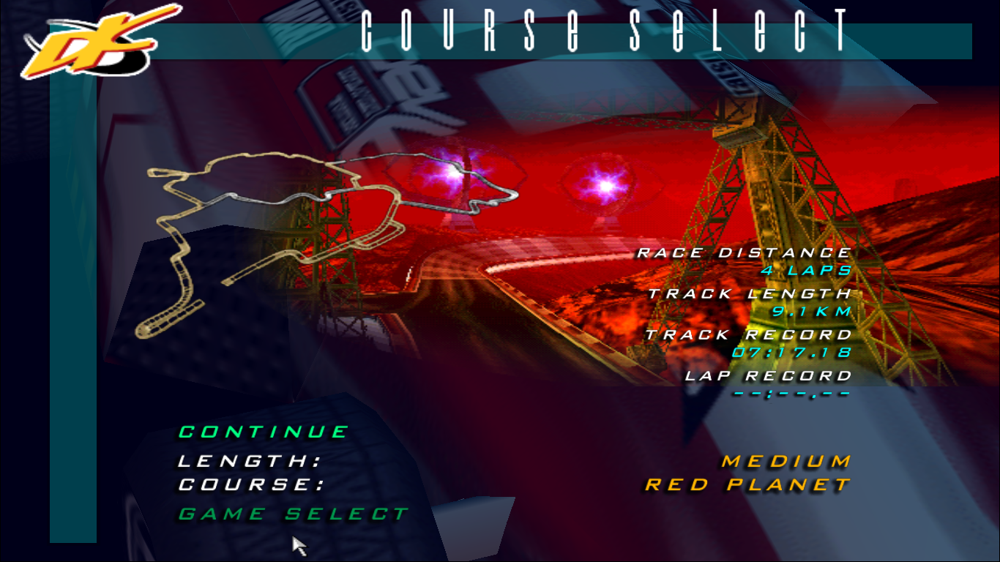
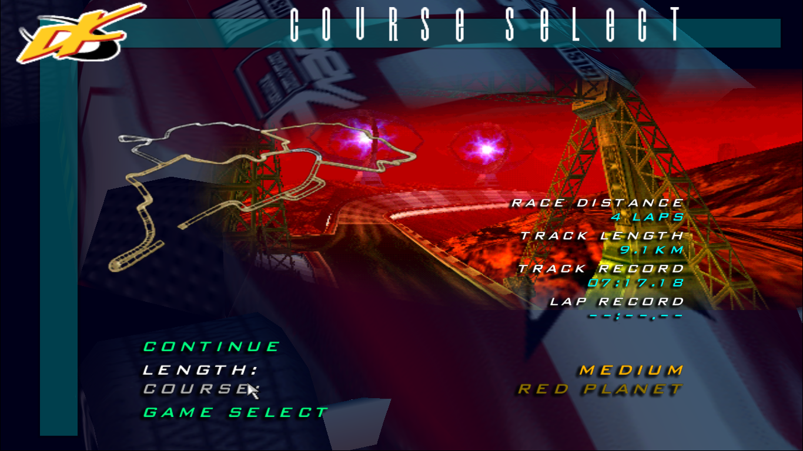

# Dethkarz-Medium-Red-Planet-Map-UI-fix
The map of Red Planet - Medium track displayed on the UI is incorrect and doesn't match the actual track being played. 
I fixed it by editing the texture of the menu UI to match the actual track displayed in-game.

## This is how the UI looked before:

## And this is how the UI looks after the fix:

## How to install:
Download the "Dethkarz.7z" file and extract it. Copy the "Dethkarz.dkz" file inside the extracted folder and go to the Dethkarz install directory. If you downloaded the game via Steam, it is usually "C:\Program Files (x86)\Steam\steamapps\common\Dethkarz

Inside the install directory, go to the subfolder named "Data" and replace the "Dethkarz.dkz" file with the new one you have downloaded. You can also rename the original "Dethkarz.dkz" to "Dethkarz.dkz.old" if you want to create a backup before replacing it.
